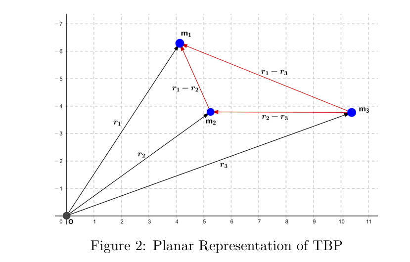
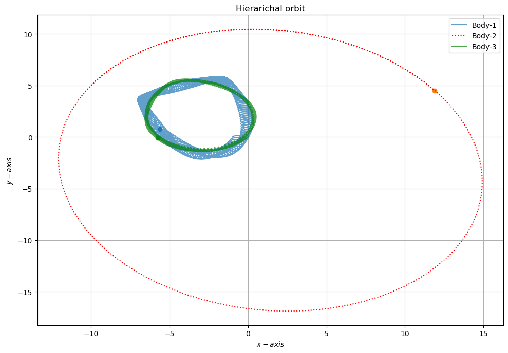

### Contributors- Sarthak Vishwakarma,Mitanshu Arora, Aman Razdan,Daksh Pandey
## Introduction

The planar restricted problem of three bodies has attracted the attention of many mathematicians and
astronomers because the model of the restricted problem can serve as a first approximation in a number
of real situations in astronomy (and more recently in astronautics). Numerical studies indicate that the
restricted problem belongs to the general class of non-integrable dynamical systems with two degrees of
freedom, and such systems are known to have an inexhaustible richness of detail in the behaviour of the
solutions. In view of its simplicity, the restricted problem can then serve as a good model problem for
the study of non-integrable systems.

## Model formulation

Let there be three bodies of masses $m_1$, $m_2$, and $m_3$ respectively.
Let $\vec{r}_1$, $\vec{r}_2$, and $\vec{r}_3$ be their position vectors
relative to the origin $O$.

By Newton’s second law,

$$
\vec{F} = m\vec{a} = m\ddot{\vec{r}}
$$

where $m$ is the mass of the body, $\vec{a}$ is the acceleration,
and $\vec{r}$ is the position vector.

The gravitational forces of attraction between the bodies are given by

$$\vec{F}_{12}=-\frac{G m_1 m_2 (\vec{r}_1 - \vec{r}_2)}{\|\vec{r}_1 - \vec{r}_2\|^3}=-\vec{F}_{21}$$

$$\vec{F}_{23}=-\frac{G m_2 m_3 (\vec{r}_2 - \vec{r}_3)}{\|\vec{r}_2 - \vec{r}_3\|^3}=-\vec{F}_{32}$$

$$\vec{F}_{31}=-\frac{G m_3 m_1 (\vec{r}_3 - \vec{r}_1)}{\|\vec{r}_3 - \vec{r}_1\|^3}=-\vec{F}_{13}$$

further simplifying equations we get total 6 equations to solve numerically in x and y direction,

$$\frac{d^2 x_1}{dt^2}=- G \left(\frac{m_2 (x_1 - x_2)}{\|\vec r_1 - \vec r_2\|^3}+\frac{m_3 (x_1 - x_3)}{\|\vec r_1 - \vec r_3\|^3}\right)$$

$$\frac{d^2 x_2}{dt^2}=- G \left(\frac{m_1 (x_2 - x_1)}{\|\vec r_2 - \vec r_1\|^3}+\frac{m_3 (x_2 - x_3)}{\|\vec r_2 - \vec r_3\|^3}\right)$$

$$\frac{d^2 x_3}{dt^2}=- G \left(\frac{m_1 (x_3 - x_1)}{\|\vec r_3 - \vec r_1\|^3}+\frac{m_2 (x_3 - x_2)}{\|\vec r_3 - \vec r_2\|^3}\right)$$

$$\frac{d^2 y_1}{dt^2}=- G \left(\frac{m_2 (y_1 - y_2)}{\|\vec r_1 - \vec r_2\|^3}+\frac{m_3 (y_1 - y_3)}{\|\vec r_1 - \vec r_3\|^3}\right)$$

$$\frac{d^2 y_2}{dt^2}=- G \left(\frac{m_1 (y_2 - y_1)}{\|\vec r_2 - \vec r_1\|^3}+\frac{m_3 (y_2 - y_3)}{\|\vec r_2 - \vec r_3\|^3}\right)$$

$$\frac{d^2 y_3}{dt^2}=- G \left(\frac{m_1 (y_3 - y_1)}{\|\vec r_3 - \vec r_1\|^3}+\frac{m_2 (y_3 - y_2)}{\|\vec r_3 - \vec r_2\|^3}\right)$$

### You can refer to our orbits and their plots codes solved using Leapfrog algorithm here- 

1- https://github.com/Sarthkv10/Planar-three-body-problem/blob/main/8%20figure.py

2- https://github.com/Sarthkv10/Planar-three-body-problem/blob/main/butterfly%201.py

3- https://github.com/Sarthkv10/Planar-three-body-problem/blob/main/hierarch.py

### Watch the animation here on my youtube channel ( click on the image)

#### Heirarchical Orbit-

